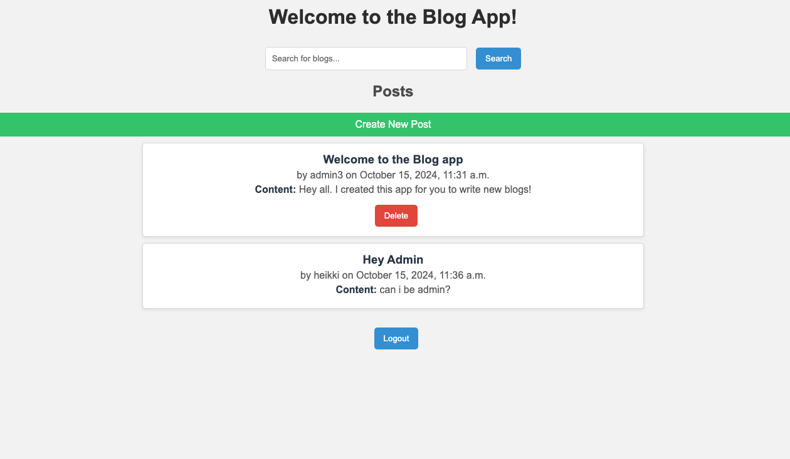

# Mooc_CyberSecurityBase_Project_1
Repository for MOOC CyberSecurityBase 2024 course project 1. https://cybersecuritybase.mooc.fi/


## Description

A blogging application with login functionality. Once logged in, users can create and publish blog posts. Also logged in users can see other users blog posts.

----------------------------------------------------------------------------------------------------------



----------------------------------------------------------------------------------------------------------

## Installation guide:
----------------------------------------------------------------------------------------------------------
NOTE: On MacOS you might need to refer to a specific python version, e.g. python3 or pip3.

1. Clone the repository to your machine

2. Create a virtual environment inside the project folder
   - 2.1 Run the command:
     ```bash
     python -m venv env
     ```
   - 2.2 Start the environment:
     - 2.2.1 Mac/Unix:
       ```bash
       source env/bin/activate
       ```
     - 2.2.2 Windows:
       ```cmd
       env\Scripts\activate.bat
       ```

3. Install requirements
   - 3.1 Run the command:
     ```bash
     pip install -r requirements.txt
     ```

4. Start the server
   - 4.1 Run the command:
     ```bash
     python manage.py runserver
     ```
   - 4.2 Access the blog site by navigating to [127.0.0.1:8000](http://127.0.0.1:8000)
----------------------------------------------------------------------------------------------------------
## User info and passwords

| User       | Password       | admin    |
|:------------:|:----------------:|:----------:|
| superadmin | admin          | yes      |
| tero       | strongPassword | no       |
| heikki     | strongPassword | no       |

## Note that you might need to migrate first: 
# python3 manage.py migrate   

----------------------------------------------------------------------------------------------------------

## Vulnerabilities

I have made flaws in code in purpose and then commented how they should be fixed. 

## 1. Fault

A1:2017 - Injection: Unsanitized user input directly in database query

# Fault Explanation:
In the search_blogs function, user input from the search query is directly inserted into an SQL query without validation or sanitization. This allows malicious users to inject SQL code, potentially compromising the database and accessing unauthorized data. This vulnerability is known as SQL Injection, which can expose sensitive data.

# Fix: 
Using Django’s ORM (Post.objects.filter(title__icontains=search_query)) safely processes the query by automatically sanitizing user input, preventing SQL injection. This approach mitigates security risks by handling query parameters securely and avoiding direct string formatting for database queries.

```python
def search_blogs(request):
    search_query = request.GET.get('query', '')
    posts = Post.objects.raw(f"SELECT * FROM posts WHERE title LIKE '%{search_query}%'") # can be injected
    return render(request, 'pages/search_results.html', {'posts': posts})    
    # posts = Post.objects.filter(title__icontains=search_query) # this is the fix
```

This code snipped can be found in code `src/pages/views.py (starting at line 125)`

## 2. Fault

A3:2017 - Sensitive Data Exposure: User password is in plain text, not including hash.

# Fault Explanation:
The register function currently stores user passwords in plain text without hashing. This flaw falls under A3:2017 - Sensitive Data Exposure, as it exposes user data to potential breaches or malicious insiders. Plain text passwords leave users vulnerable to credential theft if the database is compromised, enabling unauthorized access to user accounts.

```python
def register(request):
    if request.method == 'POST':
        form = RegistrationForm(request.POST)
        if form.is_valid():
            form.save(commit=True)
            messages.success(request, 'Registration successful! You can now log in.')
            return redirect('login') 
    else:
        form = RegistrationForm()

    return render(request, 'registration.html', {'form': form})
```

# Fix Explanation:
To protect passwords, the fix uses Django's built-in hashing function by calling set_password(), which hashes the password before saving it to the database. This approach securely stores the password in hashed form, mitigating risks of data exposure. Hashing passwords ensures that even if attackers gain access to the database, they cannot retrieve original passwords easily.

```python
# Fix: Use Django's User model which handles password hashing
# this is how user can be created safe way

def register(request):
    if request.method == 'POST':
        form = RegistrationForm(request.POST)
        if form.is_valid():
            user = form.save(commit=False) 
            user.set_password(form.cleaned_data['password']) 
            user.save()
            messages.success(request,'Registration successful! You can now log in.')
             return redirect('login')
    else:
        form = RegistrationForm()

    return render(request, 'registration.html', {'form': form})
```
This code snipped can be found `src/pages/views.py (starting at line 133)`

## 3. Fault

A10:2017 - Security Logging and Monitoring Failures

# Fault Explanation:
`Setting DEBUG = True` in a production environment is a common security misconfiguration. When enabled, Django displays detailed error messages, including stack traces, sensitive data, and other diagnostic information that can reveal valuable details to attackers. This can lead to information exposure and makes the application vulnerable to exploitation.

# Fix Explanation:
`Set DEBUG = False` in production to avoid exposing sensitive application details in error messages. When DEBUG is disabled, Django returns generic error messages to users and hides sensitive information, reducing security risks. Always ensure settings are separated for development and production, keeping production configurations secure.

This code snipped can be found `src/config/settings.py (line 25)`

## 4. Fault

A2-2017 - Broken authentication

# Fault Explanation:
The login view lacks any restriction on the number of login attempts, exposing it to brute-force attacks (OWASP A2:2017 – Broken Authentication). Without limiting attempts, attackers can continuously try passwords until they gain unauthorized access. This flaw can compromise user accounts, especially if passwords are weak or previously breached.

```python
class LoginView(View):
    def get(self, request):
        form = CustomLoginForm()
        return render(request, 'pages/login.html', {'form': form})

    def post(self, request):
        form = CustomLoginForm(data=request.POST)
        if form.is_valid():
            user = form.get_user()
            login(request, user)
            messages.success(request, 'Login successful!')
            return redirect('home')  
        else:
            messages.error(request, 'Invalid username or password.')
        return render(request, 'pages/login.html', {'form': form})
```
# Fix Explanation:
To prevent brute-force attacks, the login view now implements an IP-based rate limit, allowing only five login attempts per user every five minutes. When the limit is reached, it returns an error message and temporarily locks the user out, making automated attacks harder to execute. The cache mechanism helps track and reset failed login attempts effectively.

```python
# Login is not limiting how many login attempts you can do 
# Enabling brute-force attacks

class LoginView(View):
    def post(self, request):
        form = CustomLoginForm(data=request.POST)
        
        user_ip = request.META['REMOTE_ADDR']
        cache_key = f'login_attempts_{user_ip}'
        attempts = cache.get(cache_key, 0)
        
        if attempts >= 5:  # Allow a maximum of 5 login attempts
            messages.error(request, 'Too many login attempts. Please try again later.')
            return render(request, 'pages/login.html', {'form': form})
        
        if form.is_valid():
            user = form.get_user()
            login(request, user)
            cache.delete(cache_key) 
            messages.success(request, 'Login successful!')
            return redirect('home')  
        else:
            cache.set(cache_key, attempts + 1, timeout=300)  # Timeout of 5 minutes
            messages.error(request, 'Invalid username or password.')
        return render(request, 'pages/login.html', {'form': form})
```

This code snipped can be found `src/pages/views.py (line 18)`

## 5. Fault

A10:2017 - Security Logging and Monitoring Failures

# Fault Explanation:
By default, Django applications do not log security-related events, which leaves them vulnerable to security incidents and monitoring failures (OWASP A10:2017). Without proper logging, it becomes difficult to track unauthorized access attempts, data breaches, or other suspicious activities. This lack of visibility can hinder incident response and make it challenging to identify patterns of abuse or to perform forensic analysis after a security incident.

# Fix Explanation:
To mitigate the risk of security logging and monitoring failures, security logging is enabled in the Django application by configuring the LOGGING settings. This configuration sets up two handlers: one that logs warnings and above to a file (security.log) and another that streams logs to the console. Additionally, it establishes loggers for the Django framework, including a dedicated logger for django.security, which captures important security-related events. By doing this, the application gains the ability to monitor security events actively, allowing for better incident response and overall security posture.

Fix: Enable security logging in Django:

```python
LOGGING = {
    'version': 1,
    'disable_existing_loggers': False,
    'formatters': {
        'verbose': {
            'format': '{levelname} {asctime} {module} {message}',
            'style': '{',
        },
    },
    'handlers': {
        'file': {
            'level': 'WARNING',
            'class': 'logging.FileHandler',
            'filename': 'logs/security.log',
            'formatter': 'verbose',
        },
        'console': {
            'class': 'logging.StreamHandler',
        },
    },
    'loggers': {
        'django': {
            'handlers': ['file', 'console'],
            'level': 'WARNING',
            'propagate': True,
        },
        'django.security': {
            'handlers': ['file'],
            'level': 'WARNING',
            'propagate': False,
        },
    },
 }
```

This code snipped can be found at `(src/config/settings.py) (Line 91)`